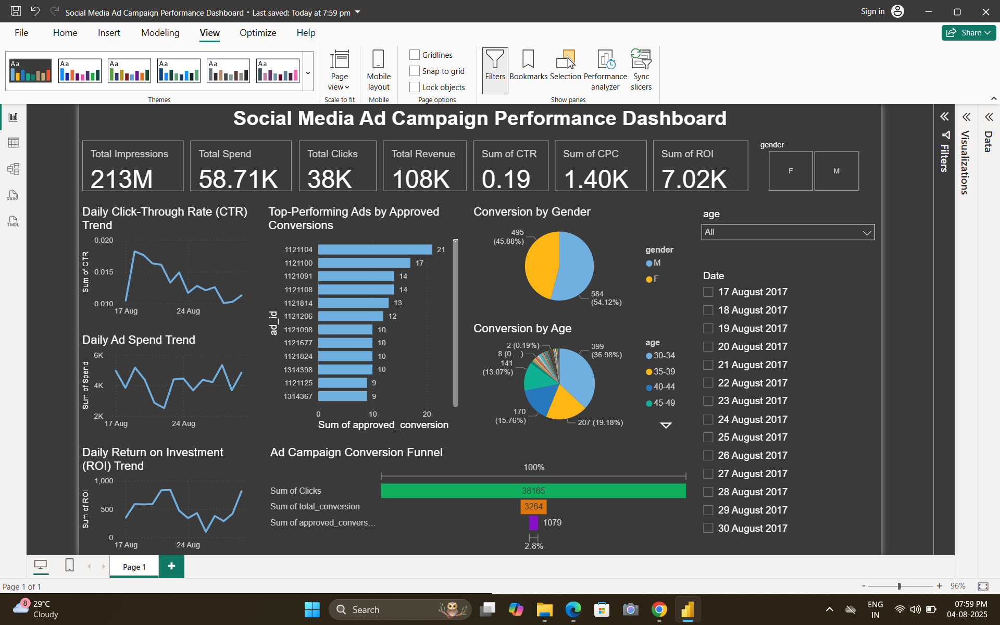

# 📊 Social Media Campaign Performance Tracker

This repository contains my second task as part of the **Future Interns Program**.

## 🔍 Task Overview
Analyze ad campaign data from **Facebook and Instagram** to evaluate:
- 📈 Campaign Performance
- ❤️ Engagement Metrics
- 🎯 Click-Through Rate (CTR)
- 💸 Return on Investment (ROI)

## ✅ Goals Achieved
- Visualized ad campaign effectiveness using KPIs like CTR, CPC, and Conversions
- Identified top-performing demographics and ad formats
- Provided actionable insights to optimize future campaigns

## 🛠 Tools & Technologies
- **Power BI** (for interactive dashboard)
- **Microsoft Excel ** (for data cleaning & transformation)

## 📁 Project Files
| File Name | Description |
|-----------|-------------|
| `Social Media Ad Campaign Performance Dashboard.pbix` | Main Power BI dashboard |
| `cleaned_data.csv` | Cleaned ad campaign dataset |
| `dashboard-preview.png` | Screenshot of the dashboard |

## 📸 Dashboard Preview

---

## 👤 About Me
I’m **Samar Manna**, a B.Tech CSE (Data Science) student passionate about marketing analytics and storytelling through data.

📬 Let’s connect: [LinkedIn](www.linkedin.com/in/samar-manna-83aa73273)
